## 一、简介
- 1995年由网景公司发明
- 早期网速比较慢，网页上的用户信息验证是由服务器负责的，速度特别慢，用户体验差，网景公司发现了该问题并发明了JavaScript，现在网速较快，所以网页信息验证并不是JavaScript的唯一功能
- EcmaScript是JavaScript的标准，但不提供具体的实现
- 不同的浏览器对EmacScript由不同的实现，如火狐的spidermonkey引擎，谷歌浏览器的V8引擎
- 完整的JavaScript实现应该包含以下三个部分
  - EcmaScript标准
  - DOM
  - BOM
- JavaScript是一种解释型的语言

## 二、第一个简单的JavaScript程序
- 我们先将JavaScript程序写在网页当中
	- head标签的scripts子标签中
- 使用alter
  - 弹出警告窗口
 
实例：

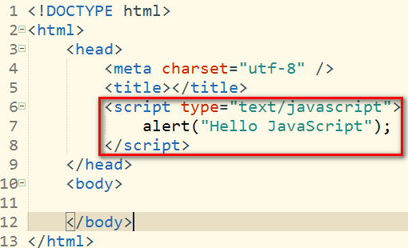

显示效果：

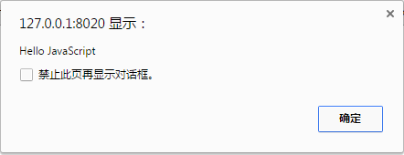

- 使用console.log
  - 在控制台上显示内容（一般按F12键可以打开浏览器的开发者工具栏，就可以找到控制台）

实例代码：

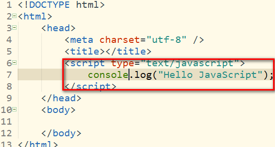

显示效果：

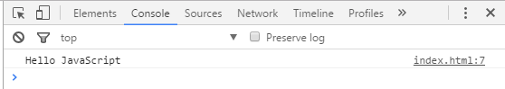

- 使用document.wtite
  - 在body标签中写入内容

实例代码：

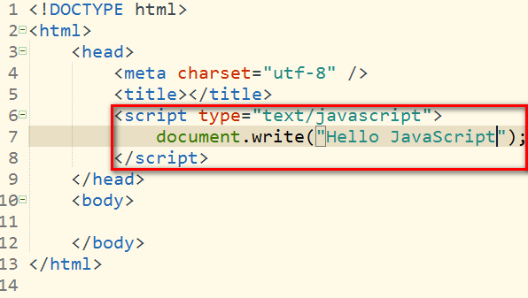

显示效果：

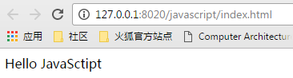

## 三、编写JavaScript的位置

- 可以直接编写在指定的标签当中

如：

在botton的onclick属性中编写js代码

```
<button onclick="alert('Hello JavaScript');">点击按钮</button>
```

上面的代码的作用是点击按钮的时候出现警告窗口

还可以在a的href的属性中编写js代码


```
<a href="javascript:alert('Hello')">点击我试试</a>
```

上面的代码的作用是当点击链接的时候会出现警告窗口

**注意:编写的js代码中不要出现双引号，不然会出现语法错误，这是因为属性值本身就是用双引号包围的，若在属性值中出先双引号，浏览器解析属性值的时候就会出错**

- 可以在script标签中编写js代码

例如我们上面介绍第一个js程序的时候使用的就是这种方式

- 在页面中引用外部的js程序
  - 将js代码编写在一个js文件中
  - 通过script标签中的src属性引用外部的js文件

如：


## 四、基本语法

### 1. 注释：
- 单行注释：`例： //这是一个单行注释`
- 多行注释： 
```
/*这是一个多行注释*/
```

### 2. 在js中严格区分大小写，并且每一个语句必须以分号结尾

### 3. js中会忽略多个空行和换行，所以我们可以利用空格和换行对代码进行缩进等处理，便于编程人员的阅读

### 4. 字面量和变量
- 字面量：一些不可改变的值，例如100等数字，'q'等字符
- 变量：值可以变化的量，可以用来保存字面量
  - 使用变量之前必须对变量进行声明和初始化
  - 变量的声明：
     - 使用var关键字进行声明一个变量： 如`var a;`
  - 变量的初始化：
      - 在等号右边给变量赋值，如`a = 12;`
  - 可以声明变量的同时给变量初始化
      - 如`var a = 12;`
  - 变量的命名
      - 可以包含数字，字母，下划线，还有美元符号
      - 但是不可以以数字开头
      - 变量名不能是js中的关键字和保留字，如var等
      - 标志名一般一般以驼峰式命名，即首字母小写，每个单词的首字大写，其余字母小写----xxxYyyZzz
      - js底层保存标识符是使用Unicode编码

### 5. 数据类型

js中共有六种数据类型，其中前五种是基本数据类型，最后一种引用数据类型，我们可以使用typeof查看一个变量的类型，格式是`typeof 变量名`

- String（字符串）：以单引号或者双引号包围的串，如'a', "abc"等
    - 使用typeof检查值的类型返回的是string
    - 单引号中不能直接嵌套单引号：如`var str = ''在单引号中不能嵌套单引号'';`是错误的，同理，双引号不能直接嵌套双引号
    - 虽然同一种引号不能直接嵌套，但是不同种引号可以进行嵌套。单引号中可以嵌套双引号，双引号可以嵌套单引号。如`var str = "'hello script'";` 或者 `var str = '"hello script"';`都是允许的
    - 单引号与双引号虽然不允许直接嵌套，但是如果你真想在引号中使用同一种引号，那么你可以通过将字符转移来实现，在要转义的字符前面加上反斜杠即可，如`var str = "I \"Love\" JavaScript";`，这种使用方法是允许的，常见的被转义的字符还有如下几种：
        - \"表示"
        - \'表示'
        - \\表示\
        - \n表示换行
        - \t表示制表符（相当于按了一次tab键）
- Number（数值）： js中，整数，浮点数都是数值型，如1, 123等
    - 使用typeof检查值的类型返回的是number
    - Number.MAX_VALUE表示最大能表达的数
    - Number.Infinity表示的是无穷大（超过Number最大能表示的范围）
    - Number.NaN表示的是不能表示的number值，如`var a = 12 * 'abc'`返回的结果是NaN
- Boolean（布尔值）：布尔值只有两种取值，分别是true和false
    - 使用typeof的返回值为boolean
- Null（空值）
    - 使用typeof检查值的类型返回的是object，注意不是null
    - 表示为空的对象
- Undefined（未定义）
    - 使用typeof检查值的类型返回的是undefined
    - 声明了一个对象，但是不给对象赋值，其值就是undefined
- Object（对象）

### 6. 强制类型转换

将一种类型的数据转换成另外一种类型的数据

- 将其他类型的数据转换成string类型
    - 第一种方式：使用toString方法
        - 首先要注意的是toString方法不改变原先的数据类型，例如代码`var a =123;a.toString(); console.log(typeof a); console.log(a);`控制台上的打印结果是:` number '123' `，要真正实现类型的转换还得将值赋值给原先的变量，例如代码`var a = 123; a = a.toString(); console.log(typeof a); console.log(a);`，控制台的显示结果是：`string '123' `
        - 将number类型转换成string：如 `var a = 123; a = a.toString(); console.log(typeof a); console.log(a);`，显示的结果是`"123"`
        -  将boolean值转化成string：如`var a = true;a = a.toString();console.log(typeof a);console.log(a);`输出的结果是：`string 'true' `，如果a的值为false，输出的结果是`'string false'`
        - null和undefined类型没有toString方法，不可以将它们转换成字符串，会报错
    - 第二种方式：使用String函数
        - 使用的方法与上面的toString方法差不多（它也不会改变原先的值的类型，只有将其再次赋值给原先的变量才能达到转换数据类型的目的），例如，将number类型的数据转换成string，`var a = 123;a = String(a);console.log(typeof a);console.log(a);`将打印以下的结果：`string '123'` 
        - 与使用toString方法不同的是null和undefined类型可以使用String函数转换成字符串，打印的结果分别对应`'null'`和`'undefined'`
     - 第三种方式：让该数据与空字符串相加，[点击链接查看详细信息](#_7_2)
- 将其他的类型转换成number类型
    - 第一种方式：使用Number函数
        - 将string类型转换成number类型
            - 如果字符串是符合规范的数字串，直接转换成number类型
            - 如果字符串是空串或者由空格组成的串的话，转成number类型时结果为0
            - 如果字符串不是以上的两种情况的话，将返回NaN值
        - 将boolean转化成number类型
            - 如果为false，返回结果为0
            - 如果为true的话，返回结果为1
        - 将null转化成number类型
            - 返回结果为0
        - 将undefined类型转换成number类型
            - 返回结果为NaN
    - 第二种方式：采用parseInt和parseFloat函数
        - 这种方法其实是专门用来处理string类型转化成number类型的情况的
        - 只要字符串是以数字（或者空格）开头的，调用这两个函数都能正确的解析出数字来，如代码：`var a = '   123.[x]'; a = parseInt(a);console.log(typeof a);console.log(a); `，显示的结果是`number 123`
        - parseInt将字符串解析成整数
        	- 语法：parseInt(string, radix)
        	    - string表示要解析的字符串，radix表示结果的表示进制，不指定默认十进制
        	- 常用的进制的数字的表示：
	    	    - 十六进制数字以0x开头
	    	    - 八进制数字以0开头
	    	    - 二进制的兼容性很差，一般推荐使用
            - 如：`parseInt(' 134.23af');`结果是`134`
        - parseFloat将字符串解析成浮点数
            - `parseFloa（' 134.23af'）;`结果是`134.23`
        - 上面的两个函数都是只能返回第一个数字，若要解析的字符串不是以数字开头，返回结果将为NaN
        - 如果非string类型的数据调用parseInt(),parseFloat()函数，其实是先将该类型转化成string类型，然后再转化number类型
    - 第三种方式：通过一元运算符正号，具体看[点击链接查看具体信息](#_7_1)
- 将其他的类型转化成boolean类型
    - 使用Boolean函数
    - 将number类型转化成boolean类型
        - 仅当number值为0或者NaN时，返回的是false
        - 除了空串，其他的返回的都是true
        - null和undefined返回的结果都是false 
       

### 7. 运算符

### <span id="_7_1">7.1 一元运算符<span>

- 正号（+）
    - 若操作数为正数，那么加上正号对其大小没有影响
    - 若操作数为非number类型，可以将该操作数转化成number类型，如`var a = 1 + (+'2')+ 3;`显示的结果是`6`
- 负号（-）
- 自增（++）
    - ++a与a++和a之间的区别
        - ++a与a++都是表达式，a是一个变量
        - a++是自增前a的值，如`var a = 10; console.log(a++);`的输出结果是`10`
        - ++a是自增后a的值，如`var a = 10; console.log(++a);`的输出结果是`11`
        - 以下代码`var a = 10; var b = (a++) + (++a) + a; console.log(b); `的结果是`64`，因为自增之后会更改原先变量的值
        - 以下代码`var a = 10; a = a++; console.log(a);`输出结果是`10`
        - 以下代码`var b = 11; b = ++b; console.log(b);`输出结果是`12`
- 自减（--）
    - 与自增操作类似


#### 7.2 二元运算符元运算符

- 加号（+）
    - 若参与运算的两个操作数中有非number和string类型的数据，会先将其转化我number类型的数据再进行运算，如`var = true + 1;`结果是`2`
    - 任何类型的数据与NaN进行进行加法运算，其结果均为NaN
    - 若操作数均为string类型，那么相加表示的是字符串的连接，例如`a = '123' + '456';`结果是`'123456'`
    - 若一操作数为string类型，而另外一个操作数不为string类型，那么，会首先将非string类型的操作数转化成string类型的操作数，然后再进行连接操作，如`var a = true + "123";`结果为`true123`
- 减号（-）
- 乘法（*）
- 除法（/）
- 取模（%）

#### 7.3 逻辑运算符
- 与（&&）
    - 仅当两边的值均为true时，结果为true
    - 若有非boolean类型数据参与运算，则先将非boolean类型转换成boolean类型，然后再进行运算
    - 该与运算是短路与，即当第一个条件为假的时候不检查第二个条件，如`false && alert("I am here");`不打印任何信息
- 或（||）
    - 仅当两边的条件均为false的时候结果false
    - 若有非boolean类型数据参与运算，则先将非boolean类型转换成boolean类型，然后再进行运算 
    - 该或运算是短路或，即当第一个条件为真的时候不检查第二个条件，如`true || alert("I am here");`不打印任何信息
- 非（！）
    - true的非为false，false的非为true
    - 对一个非boolean类型的变量取两次非可以将其转化成boolean类型，如`var a = 12; a = !!a; console.log(typeof a); console.log(a);`显示的结果是`boolean true`

#### 7.4 赋值
- 将右边的值赋值给左边的值，如：`var a = 5;`将变量a赋值为5
- 可以使用 +=， -=， *=， /=, %=

#### 7.5 关系运算符
- 结果为boolean值
- 关系运算符有>, >=, <, <=, ==，!=(不相等), ===(全等)， !==(不全等)
- 除了全等(===)和不全等(!==)外，对于其他的关系运算符，若参与运算的操作数类型不一致，会先进行类型转换后再进行比较
- 两个字符串进行相比的时候，比较的是Unicode值，若两个字符串均为数字，比较数字大小的时候一定要先进行转型，如`console.log('123' < '2')`结果返回`true`,要比较他们的大小，可以使用`console.log('123' < +'2')`此时会先将他们转成number类型再比较大小，这条语句返回的结果为`false`
- == 表示的是比较值是否相等
	- 参与比较的操作数会自动进行类型转换，如`console.log('13' == 13)；`输出的结果是`true`
    - null不等于0
    - null等于undefined
    - NaN不与任何值相等（包括NaN）
        - 由于该原因，我们无法通过==来判断一个值是否为NaN，但是我们可以通过isNaN函数来判断
- === 表示的是全等
    - 不进行自动类型转换，操作数类型不相同的时候直接返回false

- !== 表示的是不全等
	- 不进行自动类型转换，操作数类型不相等时直接返回true

#### 7.6 三元运算符
- 条件表达式？语句1：语句2；
- 条件表达式为真的时候执行语句1，否则执行语句2

### 8.使用js输出Unicode编码
- 通过转义字符
- 格式为： \\uxxxx(xxxx表示四位数，十六进制)
- 在html页面中也可以输出Unicode编码
    - 格式： &#xxxx（xxxx表示的是四位数，十进制）

### 9.代码块
- 使用{}将多个语句包含在里面
- {}里面的语句要么都执行，要么都不执行
- {}里面声明的变量对于{}外的语句完全可见的
```
{
	a = 12;
}
console.log(a);
```
打印的结果是`12`

### 10. 语句
#### 10.1 分支语句

- if语句
    - 格式： `if(条件判断){语句块}`
        - 执行步骤：当条件为真的时候执行语句块中的内容，否则不执行
- if-else语句
    - 格式： 
    ``` javascript
     	if(条件判断){
      		语句块1；
        } else{
			语句块2；
		}
	```

	- 解释：当条件判断成立时，执行语句块1，否则执行语句块2
- if-else-...-if-else语句
	- 格式：
	``` 
		if (条件判断1){
			语句1；
		} else if(条件判断2){
			语句2；
		}
		.
		.
		.
		else if(条件n){
			语句n；
		}
		else{
			语句n + 1;
		}
			
	   ```
	
	- 解释： 从上到下进行判断，若条件1成立，则执行语句块1，否则判断条件2，若条件2成立，执行语句块2，否则判断条件3，依此类推，但是最后一个语句必须是else语句

#### 10.2 循环语句
- while语句
    - 格式：
    ```
		while(循坏条件){
			语句块;
		}
	```
    - 解释：先进行判断，当循环条件成立的时候，执行循坏体中的语句块，否则退出循坏

- do-while语句
    - 格式：
	```
		do{
			语句块;
		} while(循环条件);
	```
	- 解释：先执行语句块，后执行判断。当条件成立的时候继续执行循坏体中的语句，否则退出循环

- for语句
    - 格式：
    ```
		for(语句1；语句2；语句3){
			语句4；
		}
    ```
    - 解释：语句1为初始化条件，语句2为条件判断语句，语句3为变量更新语句。最初执行语句1，然后进行条件的判断（即执行语句块2），若成立，执行语句4，然后再执行更新操作（即语句3），之后再进行条件判断，若条件成立，继续执行语句4，然后执行语句3，否则退出循环，整个循环的过程中，初始化语句（即语句1）只被执行过一次

### 11. 对象
- 简述：
    - 使用typeof打印出的值为object
    - 对象的属性名和属性值成对存在
- 分类：
    - 内建对象：
        - 有ES标准中定义的对象，在任何的ES实现中都可以使用
        - 比如：Math，String，Number，Boolean，Function，Object等
    - 宿主对象：
        - 由js的运行环境提供的对象，目前来讲主要指的是浏览器提供的对象
        - 比如BOM，DOM
    - 自定义对象：
        - 由开发人员自己创建的对象
- 创建对象
    - 使用new关键字
        - 格式:`var objectName = new Object();`
        - 比如`var person = new Object();`
    - 使用字面量（也就是使用大括号）
        - 格式： `var obj = {att1:value1, att2:value2, ...}`其中value值还可以是对象
        - 比如:   
        ``` JavaScript
        var obj = {
				name:'clarence', 
				age:11, 
				sex:'man', 
				address:{
					province:'gz', 
					street:'backstreet'
				}, 
				phone:"123456789"
			};
        ```    
- 给对象添加属性
    - 使用`.`添加添加属性和属性值
        - 格式：`objectName.attribute = value;`
        - 比如： `person.age = 12;`
        - 访问的方式：`objectName.attribute;`
        - 比如：`console.log(person.age);`
    - 使用`[]`添加属性和属性值
        - 格式：`objectName['attribute'] = value;`
        - 比如：`person['sex'] = 12;`
        - 访问的方式：`objectName[attribute];`
        - 比如：`console.log(person['sex']);`
        - 要注意的是`[]`中的属性名的类型必须是字符串，也就是要由引号包含起来
- 删除对象的属性
    - 使用delete关键字：`delete objectName.attribute;`或`delete objectName['attribute'];`
    - 比如：`delete person.age;`或者`delete person[name];`
    - 若访问已经被删除的对象的属性，打印的结果是：`undefined`
- 注意：
    - js中对于对象的属性名没有严格的要求，我们可以使用关键字和保留字作为属性名（但不推荐使用这种方法），如`person.var = 112;`是被允许的。要是属性名中含有特殊的字符，我们必须用`[]`方法来创建对象的属性和属性值，如`person['@@@@@'] = 123;`
    - 使用`[]`方法创建对象要比用`.`创建对象更加灵活，我们可以通过变量来去不同属性的值，如:
    ``` javascript
			var person = new Object();
			person.name = "Clarence"; 
			person.age = 13;
			person.sex = "male";
			var n = "name";
			console.log(person[n]);
			n = "age";
			console.log(person[n]);
			n = "sex";
			console.log(person[n]);
	```
    输出的结果是：
	```
		Clarence
        13
        male
    ```
	在整个过程中，我们使用了变量n来控制我们要取的属性的属性值
- 关于属性值
    - 属性值可以是任意数据类型，可以是基本数据类型，也可以是对象类型
- 检查对象是否包含一特定的属性
    - 使用in关键字
    - 格式： `'attributeName' in objectName；`
    - 解释： 若对象中包含属性名为attributeName的属性，则返回true，否则返回false
    - 要注意的是attributeName要使用引号包围起来，否则执行时报错
- 基本数据类型与引用类型之间的区别：
    - 基本数据类型保存在栈当中，如下所示：   
    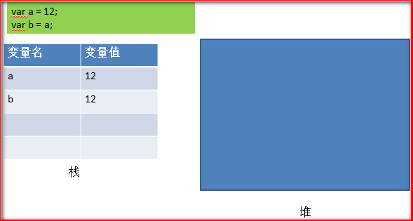    
    要注意的是将a赋值给b是将a的值复制给b，a与b相互独立，此时若我们再执行b++，a将不受影响，此时内存情况如下所示：    
    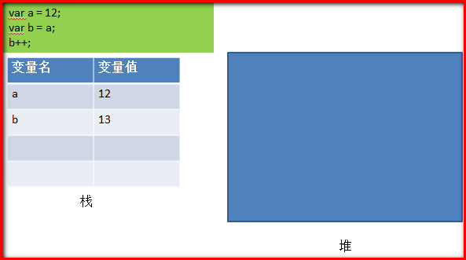  
    - 引用类型的保存涉及到堆与栈两个区域，如下所示：    
    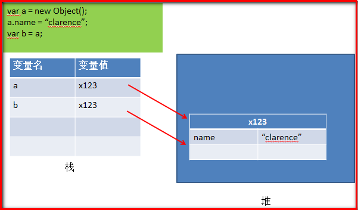  
    可以发现的是，在栈中引用变量的值其实保存的是对象在堆中的地址，将引用变量a赋值给b，相当于把地址赋值给了b，所以a与b指向了相同的对象，此时如果我们执行`b.name = "bob";`会发现a对象的name属性的值也变成了bob，此时内存中的情况如下所示：  
    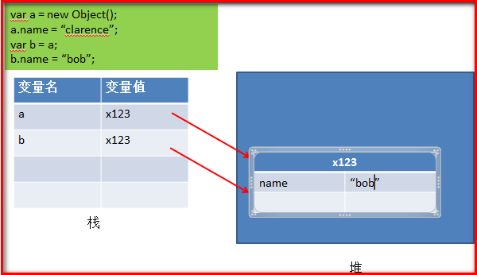  
    若此时我们执行`b = null;`a是否还指向原先的对象呢？答案是肯定的，执行`b = null;`使得其变量值变为null，并不影响a指向原先的对象，执行`b = null;`后内存的情况如下：  
    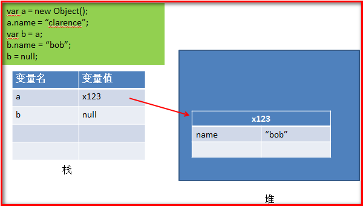   
    - 不管是基本数据类型还是引用类型，两个相同类型变量的比较，其实是它们在栈中变量值的比较，若变量值相等则相等，否则不相等。如对于基本数据类型的比较：`var a = 12; var b = 12;`，很明显在栈中变量的值是相等的，所以a = b；对于引用数据类型的比较：  
    ```
		var = new Object(); 
		a.name = "clarence"; 
		var b =  new Object(); 
		b.name="clarence;"
	```  
    尽管a与b在堆中的内容是相同的，但是在栈中，两个变量的变量值（对象的地址）是不相同的，所以两者也是不相等的               
    