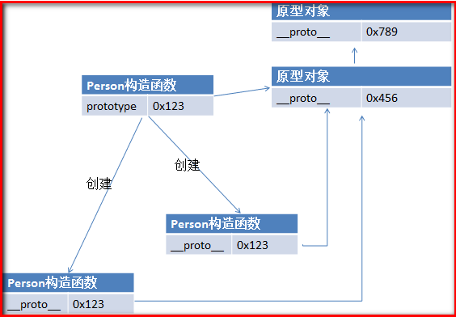
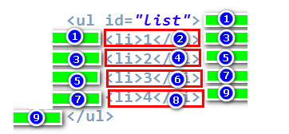

## 一、简介
- 1995年由网景公司发明
- 早期网速比较慢，网页上的用户信息验证是由服务器负责的，速度特别慢，用户体验差，网景公司发现了该问题并发明了JavaScript，现在网速较快，所以网页信息验证并不是JavaScript的唯一功能
- EcmaScript是JavaScript的标准，但不提供具体的实现
- 不同的浏览器对EmacScript由不同的实现，如火狐的spidermonkey引擎，谷歌浏览器的V8引擎
- 完整的JavaScript实现应该包含以下三个部分
  - EcmaScript标准
  - DOM
  - BOM
- JavaScript是一种解释型的语言

## 二、第一个简单的JavaScript程序
- 我们先将JavaScript程序写在网页当中
	- head标签的scripts子标签中
- 使用alter
  - 弹出警告窗口
 
实例：


显示效果：


- 使用console.log
  - 在控制台上显示内容（一般按F12键可以打开浏览器的开发者工具栏，就可以找到控制台）

实例代码：


显示效果：


- 使用document.wtite
  - 在body标签中写入内容

实例代码：


显示效果：


## 三、编写JavaScript的位置

- 可以直接编写在指定的标签当中

如：

在botton的onclick属性中编写js代码

```
<button onclick="alert('Hello JavaScript');">点击按钮</button>
```

上面的代码的作用是点击按钮的时候出现警告窗口

还可以在a的href的属性中编写js代码


```
<a href="javascript:alert('Hello')">点击我试试</a>
```

上面的代码的作用是当点击链接的时候会出现警告窗口

**注意:编写的js代码中不要出现双引号，不然会出现语法错误，这是因为属性值本身就是用双引号包围的，若在属性值中出先双引号，浏览器解析属性值的时候就会出错**

- 可以在script标签中编写js代码

例如我们上面介绍第一个js程序的时候使用的就是这种方式

- 在页面中引用外部的js程序
  - 将js代码编写在一个js文件中
  - 通过script标签中的src属性引用外部的js文件

如：


## 四、基本语法

### 1. 注释：
- 单行注释：`例： //这是一个单行注释`
- 多行注释： 
```
/*这是一个多行注释*/
```

### 2. 在js中严格区分大小写，并且每一个语句必须以分号结尾

### 3. js中会忽略多个空行和换行，所以我们可以利用空格和换行对代码进行缩进等处理，便于编程人员的阅读

### 4. 字面量和变量
- 字面量：一些不可改变的值，例如100等数字，'q'等字符
- 变量：值可以变化的量，可以用来保存字面量
  - 使用变量之前必须对变量进行声明和初始化
  - 变量的声明：
     - 使用var关键字进行声明一个变量： 如`var a;`
  - 变量的初始化：
      - 在等号右边给变量赋值，如`a = 12;`
  - 可以声明变量的同时给变量初始化
      - 如`var a = 12;`
  - 变量的命名
      - 可以包含数字，字母，下划线，还有美元符号
      - 但是不可以以数字开头
      - 变量名不能是js中的关键字和保留字，如var等
      - 标志名一般一般以驼峰式命名，即首字母小写，每个单词的首字大写，其余字母小写----xxxYyyZzz
      - js底层保存标识符是使用Unicode编码

### 5. 数据类型

js中共有六种数据类型，其中前五种是基本数据类型，最后一种引用数据类型，我们可以使用typeof查看一个变量的类型，格式是`typeof 变量名`

- String（字符串）：以单引号或者双引号包围的串，如'a', "abc"等
    - 使用typeof检查值的类型返回的是string
    - 单引号中不能直接嵌套单引号：如`var str = ''在单引号中不能嵌套单引号'';`是错误的，同理，双引号不能直接嵌套双引号
    - 虽然同一种引号不能直接嵌套，但是不同种引号可以进行嵌套。单引号中可以嵌套双引号，双引号可以嵌套单引号。如`var str = "'hello script'";` 或者 `var str = '"hello script"';`都是允许的
    - 单引号与双引号虽然不允许直接嵌套，但是如果你真想在引号中使用同一种引号，那么你可以通过将字符转移来实现，在要转义的字符前面加上反斜杠即可，如`var str = "I \"Love\" JavaScript";`，这种使用方法是允许的，常见的被转义的字符还有如下几种：
        - \"表示"
        - \'表示'
        - \\表示\
        - \n表示换行
        - \t表示制表符（相当于按了一次tab键）
- Number（数值）： js中，整数，浮点数都是数值型，如1, 123等
    - 使用typeof检查值的类型返回的是number
    - Number.MAX_VALUE表示最大能表达的数
    - Number.Infinity表示的是无穷大（超过Number最大能表示的范围）
    - Number.NaN表示的是不能表示的number值，如`var a = 12 * 'abc'`返回的结果是NaN
- Boolean（布尔值）：布尔值只有两种取值，分别是true和false
    - 使用typeof的返回值为boolean
- Null（空值）
    - 使用typeof检查值的类型返回的是object，注意不是null
    - 表示为空的对象
- Undefined（未定义）
    - 使用typeof检查值的类型返回的是undefined
    - 声明了一个对象，但是不给对象赋值，其值就是undefined
- Object（对象）

### 6. 强制类型转换

将一种类型的数据转换成另外一种类型的数据

- 将其他类型的数据转换成string类型
    - 第一种方式：使用toString方法
        - 首先要注意的是toString方法不改变原先的数据类型，例如代码`var a =123;a.toString(); console.log(typeof a); console.log(a);`控制台上的打印结果是:` number '123' `，要真正实现类型的转换还得将值赋值给原先的变量，例如代码`var a = 123; a = a.toString(); console.log(typeof a); console.log(a);`，控制台的显示结果是：`string '123' `
        - 将number类型转换成string：如 `var a = 123; a = a.toString(); console.log(typeof a); console.log(a);`，显示的结果是`"123"`
        -  将boolean值转化成string：如`var a = true;a = a.toString();console.log(typeof a);console.log(a);`输出的结果是：`string 'true' `，如果a的值为false，输出的结果是`'string false'`
        - null和undefined类型没有toString方法，不可以将它们转换成字符串，会报错
    - 第二种方式：使用String函数
        - 使用的方法与上面的toString方法差不多（它也不会改变原先的值的类型，只有将其再次赋值给原先的变量才能达到转换数据类型的目的），例如，将number类型的数据转换成string，`var a = 123;a = String(a);console.log(typeof a);console.log(a);`将打印以下的结果：`string '123'` 
        - 与使用toString方法不同的是null和undefined类型可以使用String函数转换成字符串，打印的结果分别对应`'null'`和`'undefined'`
     - 第三种方式：让该数据与空字符串相加，[点击链接查看详细信息](#_7_2)
- 将其他的类型转换成number类型
    - 第一种方式：使用Number函数
        - 将string类型转换成number类型
            - 如果字符串是符合规范的数字串，直接转换成number类型
            - 如果字符串是空串或者由空格组成的串的话，转成number类型时结果为0
            - 如果字符串不是以上的两种情况的话，将返回NaN值
        - 将boolean转化成number类型
            - 如果为false，返回结果为0
            - 如果为true的话，返回结果为1
        - 将null转化成number类型
            - 返回结果为0
        - 将undefined类型转换成number类型
            - 返回结果为NaN
    - 第二种方式：采用parseInt和parseFloat函数
        - 这种方法其实是专门用来处理string类型转化成number类型的情况的
        - 只要字符串是以数字（或者空格）开头的，调用这两个函数都能正确的解析出数字来，如代码：`var a = '   123.[x]'; a = parseInt(a);console.log(typeof a);console.log(a); `，显示的结果是`number 123`
        - parseInt将字符串解析成整数
        	- 语法：parseInt(string, radix)
        	    - string表示要解析的字符串，radix表示结果的表示进制，不指定默认十进制
        	- 常用的进制的数字的表示：
	    	    - 十六进制数字以0x开头
	    	    - 八进制数字以0开头
	    	    - 二进制的兼容性很差，一般推荐使用
            - 如：`parseInt(' 134.23af');`结果是`134`
        - parseFloat将字符串解析成浮点数
            - `parseFloa（' 134.23af'）;`结果是`134.23`
        - 上面的两个函数都是只能返回第一个数字，若要解析的字符串不是以数字开头，返回结果将为NaN
        - 如果非string类型的数据调用parseInt(),parseFloat()函数，其实是先将该类型转化成string类型，然后再转化number类型
    - 第三种方式：通过一元运算符正号，具体看[点击链接查看具体信息](#_7_1)
- 将其他的类型转化成boolean类型
    - 使用Boolean函数
    - 将number类型转化成boolean类型
        - 仅当number值为0或者NaN时，返回的是false
        - 除了空串，其他的返回的都是true
        - null和undefined返回的结果都是false 
       

### 7. 运算符

### <span id="_7_1">7.1 一元运算符<span>

- 正号（+）
    - 若操作数为正数，那么加上正号对其大小没有影响
    - 若操作数为非number类型，可以将该操作数转化成number类型，如`var a = 1 + (+'2')+ 3;`显示的结果是`6`
- 负号（-）
- 自增（++）
    - ++a与a++和a之间的区别
        - ++a与a++都是表达式，a是一个变量
        - a++是自增前a的值，如`var a = 10; console.log(a++);`的输出结果是`10`
        - ++a是自增后a的值，如`var a = 10; console.log(++a);`的输出结果是`11`
        - 以下代码`var a = 10; var b = (a++) + (++a) + a; console.log(b); `的结果是`64`，因为自增之后会更改原先变量的值
        - 以下代码`var a = 10; a = a++; console.log(a);`输出结果是`10`
        - 以下代码`var b = 11; b = ++b; console.log(b);`输出结果是`12`
- 自减（--）
    - 与自增操作类似


#### 7.2 二元运算符元运算符

- 加号（+）
    - 若参与运算的两个操作数中有非number和string类型的数据，会先将其转化我number类型的数据再进行运算，如`var = true + 1;`结果是`2`
    - 任何类型的数据与NaN进行进行加法运算，其结果均为NaN
    - 若操作数均为string类型，那么相加表示的是字符串的连接，例如`a = '123' + '456';`结果是`'123456'`
    - 若一操作数为string类型，而另外一个操作数不为string类型，那么，会首先将非string类型的操作数转化成string类型的操作数，然后再进行连接操作，如`var a = true + "123";`结果为`true123`
    - 若操作数中有undefined参与运算，则计算结果为NaN
- 减号（-）
- 乘法（*）
- 除法（/）
- 取模（%）

#### 7.3 逻辑运算符
- 与（&&）
    - 仅当两边的值均为true时，结果为true
    - 若有非boolean类型数据参与运算，则先将非boolean类型转换成boolean类型，然后再进行运算
    - 该与运算是短路与，即当第一个条件为假的时候不检查第二个条件，如`false && alert("I am here");`不打印任何信息
    - 特殊：
    	- 只要“&&”前面是false，无论“&&”后面是true还是false，结果都将返“&&”前面的值
    	- 只要“&&”前面是true，无论“&&”后面是true还是false，结果都将返“&&”后面的值 
- 或（||）
    - 仅当两边的条件均为false的时候结果false
    - 若有非boolean类型数据参与运算，则先将非boolean类型转换成boolean类型，然后再进行运算 
    - 该或运算是短路或，即当第一个条件为真的时候不检查第二个条件，如`true || alert("I am here");`不打印任何信息
    - 特殊：
    	- 只要“||”前面为false,不管“||”后面是true还是false，都返回“||”后面的值
    	- 只要“||”前面为true,不管“||”后面是true还是false，都返回“||”前面的值
- 非（！）
    - true的非为false，false的非为true
    - 对一个非boolean类型的变量取两次非可以将其转化成boolean类型，如`var a = 12; a = !!a; console.log(typeof a); console.log(a);`显示的结果是`boolean true`

#### 7.4 赋值
- 将右边的值赋值给左边的值，如：`var a = 5;`将变量a赋值为5
- 可以使用 +=， -=， *=， /=, %=

#### 7.5 关系运算符
- 结果为boolean值
- 关系运算符有>, >=, <, <=, ==，!=(不相等), ===(全等)， !==(不全等)
- 除了全等(===)和不全等(!==)外，对于其他的关系运算符，若参与运算的操作数类型不一致，会先进行类型转换后再进行比较
- 两个字符串进行相比的时候，比较的是Unicode值，若两个字符串均为数字，比较数字大小的时候一定要先进行转型，如`console.log('123' < '2')`结果返回`true`,要比较他们的大小，可以使用`console.log('123' < +'2')`此时会先将他们转成number类型再比较大小，这条语句返回的结果为`false`
- == 表示的是比较值是否相等
	- 参与比较的操作数会自动进行类型转换，如`console.log('13' == 13)；`输出的结果是`true`
    - null不等于0
    - null等于undefined
    - NaN不与任何值相等（包括NaN）
        - 由于该原因，我们无法通过==来判断一个值是否为NaN，但是我们可以通过isNaN函数来判断
- === 表示的是全等
    - 不进行自动类型转换，操作数类型不相同的时候直接返回false

- !== 表示的是不全等
	- 不进行自动类型转换，操作数类型不相等时直接返回true

#### 7.6 三元运算符
- 条件表达式？语句1：语句2；
- 条件表达式为真的时候执行语句1，否则执行语句2

### 8.使用js输出Unicode编码
- 通过转义字符
- 格式为： \\uxxxx(xxxx表示四位数，十六进制)
- 在html页面中也可以输出Unicode编码
    - 格式： &#xxxx（xxxx表示的是四位数，十进制）

### 9.代码块
- 使用{}将多个语句包含在里面
- {}里面的语句要么都执行，要么都不执行
- {}里面声明的变量对于{}外的语句完全可见的
```
{
	a = 12;
}
console.log(a);
```
打印的结果是`12`

### 10. 语句
#### 10.1 分支语句

- if语句
    - 格式： `if(条件判断){语句块}`
        - 执行步骤：当条件为真的时候执行语句块中的内容，否则不执行
- if-else语句
    - 格式： 
    ``` javascript
     	if(条件判断){
      		语句块1；
        } else{
			语句块2；
		}
	```

	- 解释：当条件判断成立时，执行语句块1，否则执行语句块2
- if-else-...-if-else语句
	- 格式：
	``` 
		if (条件判断1){
			语句1；
		} else if(条件判断2){
			语句2；
		}
		.
		.
		.
		else if(条件n){
			语句n；
		}
		else{
			语句n + 1;
		}
			
	   ```
	
	- 解释： 从上到下进行判断，若条件1成立，则执行语句块1，否则判断条件2，若条件2成立，执行语句块2，否则判断条件3，依此类推，但是最后一个语句必须是else语句

#### 10.2 循环语句
- while语句
    - 格式：
    ```
		while(循坏条件){
			语句块;
		}
	```
    - 解释：先进行判断，当循环条件成立的时候，执行循坏体中的语句块，否则退出循坏

- do-while语句
    - 格式：
	```
		do{
			语句块;
		} while(循环条件);
	```
	- 解释：先执行语句块，后执行判断。当条件成立的时候继续执行循坏体中的语句，否则退出循环

- for语句
    - 格式：
    ```
		for(语句1；语句2；语句3){
			语句4；
		}
    ```
    - 解释：语句1为初始化条件，语句2为条件判断语句，语句3为变量更新语句。最初执行语句1，然后进行条件的判断（即执行语句块2），若成立，执行语句4，然后再执行更新操作（即语句3），之后再进行条件判断，若条件成立，继续执行语句4，然后执行语句3，否则退出循环，整个循环的过程中，初始化语句（即语句1）只被执行过一次

### 11. 对象
- 简述：
    - 使用typeof打印出的值为object
    - 对象的属性名和属性值成对存在
- 分类：
    - 内建对象：
        - 有ES标准中定义的对象，在任何的ES实现中都可以使用
        - 比如：Math，String，Number，Boolean，Function，Object等
    - 宿主对象：
        - 由js的运行环境提供的对象，目前来讲主要指的是浏览器提供的对象
        - 比如BOM，DOM
    - 自定义对象：
        - 由开发人员自己创建的对象
- 创建对象
    - 使用new关键字
        - 格式:`var objectName = new Object();`
        - 比如`var person = new Object();`
    - 使用字面量（也就是使用大括号）
        - 格式： `var obj = {att1:value1, att2:value2, ...}`其中value值还可以是对象
        - 比如:   
        ``` JavaScript
        var obj = {
				name:'clarence', 
				age:11, 
				sex:'man', 
				address:{
					province:'gz', 
					street:'backstreet'
				}, 
				phone:"123456789"
			};
        ```    
- 给对象添加属性
    - 使用`.`添加添加属性和属性值
        - 格式：`objectName.attribute = value;`
        - 比如： `person.age = 12;`
        - 访问的方式：`objectName.attribute;`
        - 比如：`console.log(person.age);`
    - 使用`[]`添加属性和属性值
        - 格式：`objectName['attribute'] = value;`
        - 比如：`person['sex'] = 12;`
        - 访问的方式：`objectName[attribute];`
        - 比如：`console.log(person['sex']);`
        - 要注意的是`[]`中的属性名的类型必须是字符串，也就是要由引号包含起来
- 删除对象的属性
    - 使用delete关键字：`delete objectName.attribute;`或`delete objectName['attribute'];`
    - 比如：`delete person.age;`或者`delete person[name];`
    - 若访问已经被删除的对象的属性，打印的结果是：`undefined`
- 注意：
    - js中对于对象的属性名没有严格的要求，我们可以使用关键字和保留字作为属性名（但不推荐使用这种方法），如`person.var = 112;`是被允许的。要是属性名中含有特殊的字符，我们必须用`[]`方法来创建对象的属性和属性值，如`person['@@@@@'] = 123;`
    - 使用`[]`方法创建对象要比用`.`创建对象更加灵活，我们可以通过变量来去不同属性的值，如:
    ``` javascript
			var person = new Object();
			person.name = "Clarence"; 
			person.age = 13;
			person.sex = "male";
			var n = "name";
			console.log(person[n]);
			n = "age";
			console.log(person[n]);
			n = "sex";
			console.log(person[n]);
	```
    输出的结果是：
	```
		Clarence
        13
        male
    ```
	在整个过程中，我们使用了变量n来控制我们要取的属性的属性值
- 关于属性值
    - 属性值可以是任意数据类型，可以是基本数据类型，也可以是对象类型
- 检查对象是否包含一特定的属性
    - 使用in关键字
    - 格式： `'attributeName' in objectName；`
    - 解释： 若对象中包含属性名为attributeName的属性，则返回true，否则返回false
    - 要注意的是attributeName要使用引号包围起来，否则执行时报错
- 基本数据类型与引用类型之间的区别：
    - 基本数据类型保存在栈当中，如下所示：   
        
    要注意的是将a赋值给b是将a的值复制给b，a与b相互独立，此时若我们再执行b++，a将不受影响，此时内存情况如下所示：    
      
    - 引用类型的保存涉及到堆与栈两个区域，如下所示：    
      
    可以发现的是，在栈中引用变量的值其实保存的是对象在堆中的地址，将引用变量a赋值给b，相当于把地址赋值给了b，所以a与b指向了相同的对象，此时如果我们执行`b.name = "bob";`会发现a对象的name属性的值也变成了bob，此时内存中的情况如下所示：  
      
    若此时我们执行`b = null;`a是否还指向原先的对象呢？答案是肯定的，执行`b = null;`使得其变量值变为null，并不影响a指向原先的对象，执行`b = null;`后内存的情况如下：  
       
    - 不管是基本数据类型还是引用类型，两个相同类型变量的比较（使用==），其实是它们在栈中变量值的比较，若变量值相等则相等，否则不相等。如对于基本数据类型的比较：`var a = 12; var b = 12;`，很明显在栈中变量的值是相等的，所以a = b；对于引用数据类型的比较：  
    ```
		var = new Object(); 
		a.name = "clarence"; 
		var b =  new Object(); 
		b.name="clarence;"
	```  
    尽管a与b在堆中的内容是相同的，但是在栈中，两个变量的变量值（对象的地址）是不相同的，所以两者也是不相等的      

### 12. 函数
- 简述：
    - 函数也是一个对象
    - 函数中可以封装执行语句
    - 使用typeof的输出结果是function
- 函数的定义：
    - 第一种方法（了解即可）：通过构造函数
        - 如：      
        ``` 
			var fun1 = new Function("console.log('I am function 1');");
			fun1();
		```    
        - 上述代码的执行结果是：`I am function 1`
        - 要注意的是，被封装到函数中的代码必须包含在引号中，如上代码所示，语句`console.log('I am function 1');`被包含在了双引号之内
        - 第二个语句表示执行函数，下面会详细介绍
	- 第二种方法：通过函数声明
	    - 格式：     
	    ```javascript
			function functionName([param1, param2, ...]){
				statements;
			} 
		```    
		- 如：      
		```javascript
			function fun2(){
				console.log("hello world");
			}
			fun2();
		```      
		- 代码的执行结果是：`hello world`
		- 要注意的是函数的参数列表可以为空，如上面的示例就是一个无参的函数              
	- 第三种方法：通过函数表达式，即将匿名函数赋值给变量，此时变量名相当于函数名，可以通过变量名来引用函数
	    - 格式：     
	    ```javascript 
			var functionName = function([param1, param2, ...]){
				statements;
			}
		```      
		- 等号右边定义了一个匿名函数，函数可以没有任何参数
		- 如：    
		```javascript
			var fun3 = function(){
				console.log("I am function 3");
			}
			fun3();
		```    
		- 函数的执行结果是： `I am function 3`
- 函数的执行：
    - 格式：`functionName(param1, param2, ...);`
    - functionName表示的是函数名，小括号中的参数为实参，表示传给函数的实际值
	- 如：调用函数fun1，代码如下，` fun1();`
- 参数
    - 定义函数的时候，函数中可以带参数，这些参数也就做形参，如：  
    ```javascript 
		function add(a, b, c){
			cosole.log(a + b + c);
		}
	```  
    - 上面的代码中，a, b, c都是函数的参数，注意声明参数的时候不用加上var关键字，如a，b，c前面都不用写var关键字
    - 我们调用带参数的函数的时候需要具体指定形参的值，传进去的值叫做实参
        - 若实参的数目少于形参的数目时，实参将从左到右依次赋值给形参，没有被赋值的实参的值为undefined  
        ```javascript 
			function show(a, b, c){
				console.log(a);
				console.log(b);
				console.log(c);
			}
			show(1, 3);
		```  
        上面代码的结果是`1 3 undefined`
		- 若实参数目与形参数目相同，这是正常调用的情况
		- 若实参数目多于形参的数目，那么多余的实参会被丢弃  
		``` javascript
			function show(a, b, c){
				console.log(a);
				console.log(b);
				console.log(c);
			}
			show(1, 2, 3, 4);			
		```  
		实参4不会赋值给任何的形参  
	- 调用函数的时候，函数并不会检查实参的类型的
	- 参数可以是任意类型（包括对象，函数）  
	```
		function fun(f, a, b){
			return f(a, b);
		}
			
		function add(a, b){
			return a + b;
		}
			
		var res = fun(add, 12, 13);
		console.log(res);
	```  
    上面打印的结果是：`25`，上面的代码我们将add函数作为参数传给了fun函数，在fun函数中调用add函数返回结果，这里要注意的是传给fun函数的实参值是函数名（在这里是add）而不是函数名加括号（如add(1, 2)），将add(1, 2)做为实参实际上是将add函数的返回值作为实参
- 返回值
	- 在函数体中（大括号内），可以使用return关键字将函数处理的结果返回给调用者  
	```javascript
    	function add(a, b){
			return a + b;
		}
		var sum = add(12, 33);	
		console.log(sum);

	```  
    函数的打印结果是：`45`
	- 执行return语句后将退出整个函数
- 对象的属性的属性值也可以是函数，但我们一般不称其为函数，而是称之为对象的方法。如下代码所示：  
```javascript
	var person = new Object();
	person.id = 1;
	person.name = "clarence";
	person.getId = function(){
		return this.id;
	}
	person.getName = function(){
		return this.name;
	}
	console.log(person.getId());
	console.log(person.getName());
```
- 立即函数
	- 函数会立即执行
    - 立即函数只执行一次，之后无法再次调用
    - 格式：  
    ```javascript
		(匿名函数声明)(参数列表);
	```  
	如：    
    ```javascript
		(function(){
			alert("hello world");
		})();
	```  
	千万要注意的是：匿名函数的声明必须在小括号中，否则执行会提示错误

### 13.函数的作用域
- 全局作用域
    - **直接**在script标签编写的代码都在全局作用域中，在全局作用域中的变量叫做全局变量
    - 全局作用域随页面的创建而创建，随页面的关闭而消失
    - 全局变量在整个js程序中均可以使用，若在声明之前使用，变量的值将是undefined，如`console.log(a); var = 12;`打印出的结果是：`undefined`，这是变量的提前声明所导致的，我们很快就会详细介绍
    - 在全局作用域中，有一个全局对象window  
        - 它代表的是整个浏览器窗口
        - 该对象由浏览器创建，可以直接使用
        - 在全局作用域中创建的变量都作为window的一个属性
        - 在全局作用域中创建的函数都作为window对象的方法
        - 以下代码是等价的  
	    代码一：  
	    ```javascript
			var a = 12;
			console.log(a);
		```
		代码二： 
		```javascript
			var a = 12;
			console.log(window.a);
		```	
- 函数作用域
    - 在函数中使用var声明的变量，只能在函数中被访问，不可以在函数外使用，但是函数可以访问外部声明的变量，如以下代码：      
    ```javacript
		var a = 12;
		function fun(){
			console.log(a);	 //正确
			var b = 13;
		}
		fun();
		console.log(b);		//错误：提示引用错误
	```
	- 若在函数中定义的变量不使用var关键字进行声明的话，该变量将作为全局变量，而不是函数内的局部变量，如以下代码：  
	```javascript
		function fun(){
			c = 12;
		}
		fun();
		console.log(c);
	```  
	执行上面的代码，我们发现我们在函数外可以访问到了函数中声明的变量，这是因为变量c没有以var关键字进行声明，所以c变量其实是全局变量，故我们在函数外可以访问得到该变量 
	接下来我们看以下的代码  
	```javascript
		function fun(){
			var c = 12;
		}
		fun();
		console.log(c);
	```  
	在这段代码中，函数中的变量c使用var关键字进行声明，此时执行console.log(c)，控制台提示引用错误。这是因为此时c是函数内的局部变量，所以外部无法直接访问该变量

- 声明提前
	- 不管是在全局作用域中还是在函数作用域中，都有声明提前的现象
    - 变量声明提前：
        - 在全局作用域（函数作用域）中使用var关键字声明的变量都会先于全局作用域（函数作用域）其他代码执行，此时变量的值为undefined，如以下的代码：    
    	```javascript
			console.log(a);
			var a = 12;
		```    
		等价于：  
		```javascript
			var a;
			console.log(a);
			a = 12;
		```  
		所以程序的执行结果为`undefined`
		- 若不使用var关键字声明变量的话，该变量是不会被提前的，如下面的代码将提示引用错误    
		```javascript
			console.log(a);
			a = 12;
		```    
    - 函数声明提前：
        - 我们之前已经学习过创建函数的三种方式了，若我们使用声明函数的方式，也就是使用以下的方法创建函数  
        ```javascript
			function funName([paramList]){
				statements;
			} 
		```
		那么可能会有函数声明提前现象的发生，如以下的代码：  
		```javascript
			fun();
			function fun(){
				console.log("Hello world");
			}
		```  
		会发现，函数的调用在函数的声明之前了，但是代码仍正常执行，上面的代码等价于  
		```javascrpt
			function fun(){
				console.log("Hello world");
			}
			fun();
		```
		- 如果我们使用函数表达式的方法创建函数，此时执行下面的代码将是错误的  
		```javascript
			console.log(fun);
			fun();
			var fun = function(){
				console.log("Hello world");
			};

		```  
		执行`console.log(fun);`时，由于变量声明提前，所以打印出`undefined`，但当我们调用fun函数的时候，控制台提示"Uncaught TypeError: undefined is not a function"错误，可见以这种方式创建函数是不会发生函数声明提前的  

### 14. 创建对象的方法
- 直接使用`new Object`关键字创建对象
```
	var obj = new Object();
```  
- 使用工厂方法创建对象  
```javascript
	function createObject(name, age, gender){
		var obj = new Object();
		obj.name = name;
		obj.age = age;
		obj.gender = gender;
		obj.sayName = function(){
			alert(this.name);
		};
		obj.sayAge = function(){
			alert(this.age);
		};
		obj.sayGender = function(){
			alert(this.gender);
		};
		return obj;
	}
	
	var person = createObject("桔梗", 50, "女");
	person.sayName();
	person.sayAge();
	person.sayGender();

	var person = createObject("犬夜叉", 50, "男");
	person.sayName();
	person.sayAge();
	person.sayGender();
```  
- 使用构造函数创建对象
    - 构造函数也被称为类
    - 使用构造函数创建的对象也叫做类的实例
    - 通过instanceof关键字，我们可以看一实例对象所属的类，格式为：`实例 instanceof 类`，若为类的实例返回真，否则返回false       
```javascript
	function Person(name, age, gender){
		this.name = name;
		this.age = age;
		this.gender = gender;
		this.sayName = function(){
			alert(this.name);
		};
	}
	
	var person = new Person("swk", 12, "man");
	person.sayName();
	console.log(person instanceof Person);//结果是：true
```
**为了区别与其他一般的函数，构造函数名的第一个字母应大写**   

### 15. this关键字
- 当以函数的形式调用的时候，this代表的是window对象  
- 当以方法的形式调用的时候，this代表的是调用该方法的对象  
```javascript
	var name = "全局";
	
	function fun(){
		console.log(this.name);
	}
	
	var obj = {
		name : "孙悟空",
		sayName : fun
	};
	
	var obj2 = {
		name : "沙僧",
		sayName:fun
	};
	
	fun();//打印出的是'全局'
	obj.sayName();
	obj2.sayName();
	
	var obj = {
		name: "孙悟空",
		age: 13,
		gender : "男",
		sayName:function(){
			alert(this.name);
		}
	};
	obj.sayName();//打印出'孙悟空'
	obj.sayName();//打印出'沙僧'
```  
- 当以构造函数的形式调用的时候，this代表的是新创建的对象  
```javascript
	function Person(name, age, gender){
		this.name = name;
		this.age = age;
		this.gender = gender;
		this.sayName = function(){
			alert(this.name);
		};
	}
	
	var person = new Person("swk", 12, "man");
	person.sayName();
```  

### 16. 原型对象  
- 原型对象也是一个对象
- 解析器会为我们创建的函数增加一个prototype属性
- 每一个函数都有一个prototype且各不相同
- 若函数作为普通的函数调用，prototype没有什么作用
- 若函数作为构造函数使用，那么通过构造函数创建的每个对象都会有一个__proto__属性，该属性是由解析器添加的，并且也指向了构造函数的prototype对象，如下图所示：  
  
- 由于prototype也是一个对象，那么它也会有一个自己的原型对象，可以通过对象的__proto__属性访问
- 同一构造函数创建的对象共享构造函数的原型对象，原型对象相当于一个公共的区域，可供对象共同访问，如以下代码： 
   
``` javascript
	function Person(name, age, sex){
		this.name = name;
		this.age = age;
		this.sex = sex;
	}
	
	//在原型对象中添加一个say方法
	Person.prototype.say = function(){
		console.log("我是" + this.name);
	}
	
	
	var person1 = new Person("孙悟空", 12, "男");
	var person2 = new Person("猪八戒", 13, "男");
	var person3 = new Person("白骨精", 1, "女");
	
	person1.say();	//我是孙悟空		
	person2.say();  //我是孙悟空			
	person3.say();	//我是白骨精
```
- 当访问一个对象的属性和方法的时候，首先会从对象本身查找相应的属性和方法，若能找到则直接使用（如代码一），若不能则会去其原型对象中查找，若能查找到该属性或者方法，则直接使用，否则去原型对象的原型对象中查找，依次类推，直到找到Object对象，若该对象也查找不到所要访问的属性或者方法，程序提示属性或者方法undefined  
代码一：
    
``` javascript 
	function Person(name, age, sex){
		this.name = name;
		this.age = age;
		this.sex = sex;
	}
	
	//在原型对象中添加一个say方法
	Person.prototype.say = function(){
		console.log("我是" + this.name);
	}
	
	//因为对象本身就存在age属性，所以直接访问对象本身的age属性
	console.log(new Person("孙悟空", 12, "男").age);
```    

代码二：

```javascript
	function Person(name, age, sex){
		this.name = name;
		this.age = age;
		this.sex = sex;
	}
	
	//在原型对象中添加一个say方法
	Person.prototype.say = function(){
		console.log("我是" + this.name);
	}
	
	var person = new Person("孙悟空", 12, "男");
	//由于对象本身并没有say方法，而其原型对象有say方法，所以此时会调用原型中的say方法
	person.say(); //我是孙悟空
```  

代码三：  
  
```javascript
	function Person(name, age, sex){
		this.name = name;
		this.age = age;
		this.sex = sex;
	}
	
	//在原型对象中添加一个say方法
	Person.prototype.say = function(){
		console.log("我是" + this.name);
	}
	
	var person = new Person("孙悟空", 12, "男");
	//由于对象及其原型链上都不存在a属性，所以打印出undefined
	console.log(person.a); 
```  
- 之前我们知道利用in关键字可以知道某一属性是否属于对象，但是如果对象本身包含某一属性，而其原型对象中存在该属性，那么使用in关键字仍返回true。若要知道对象本身是否存在某一属性，那么我们需要使用hasOwnProperty()方法  

```javascript
	function Person(name, age, sex){
		this.name = name;
		this.age = age;
		this.sex = sex;
	}
	
	var person = new Person("猪八戒", 2, "男");
	
	//在原型对象中添加一个say方法
	Person.prototype.say = function(){
		console.log("我是" + this.name);
	}
	
	//虽然对象本身没有say方法，但是在该对象的原型中存在该属性，使用in关键字将返回true
	console.log('say' in person);  //  true
	//person对象本身存在age属性，所以返回值为真
	console.log(person.hasOwnProperty("age"));//true
	//尽管对象的原型中存在该方法，但是对象本身没有say方法，所以使用hasOwnProperty("say")返回false
	console.log(person.hasOwnProperty("say"));  //faslse
```  
- 除了Object对象之外，其他的都有一个__proto__属性，指向其原型对象  

### 17. 在构造函数函数共享方法问题  
先来看以下的代码：  
```
	function Person(name, age, gender){
		this.name = name;
		this.age = age;
		this.gender = gender;
		this.sayName = function(){
			alert(this.name);
		};
	}
	
	var person = new Person("swk", 12, "man");
	var person2 = new Person("zbj", 14, "woman");
	
	console.log(person.sayName == person2.sayName); //false
```  
我们发现使用函数创建对象，每创建一个对象，就创建一个sayName方法，这样显然不太好     
下面是第一种解决方法，在全局中声明函数，然后将其赋值给对象的方法       
```
	function Person(name, age, gender){
		this.name = name;
		this.age = age;
		this.gender = gender;
		this.sayName = say;
	}
	
	function say(){
			alert(this.name);
	};
	
	var person = new Person("swk", 12, "man");
	var person2 = new Person("zbj", 14, "woman");
	
	console.log(person.sayName == person2.sayName); //true
```  
上面的结果打印的是true，可见使用同一构造函数创建的对象确实共享了同一函数，但是这样做却是有一个弊端，也就是命名空间污染问题----因为我们是在全局中定义了对象的函数，假设我们的项目是多人开发，那么他人就可能定义与你在全局中定义的对象方法相同的函数，此时你的方法可能被覆盖，所以使用这种方法也是不安全的   
下面我们来看第三种解决方案：将对象的公共属性或者方法设置在原型对象中 
  
```javascript
	function Person(name, age, sex){
		this.name = name;
		this.age = age;
		this.sex = sex;
	}
	
	Person.prototype.say = function(){
		console.log(this.name);
	}
	
	var person = new Person("猪八戒", 2, "男");
	var person2 = new Person("孙悟空", 3, "男");
	
	person.say();
	person2.say();
	
```         

###  18. 数组
- 简介：
    - 数组也是一个对象
    - 数组中的元素通过索引进行访问 
    - 数组的索引从0开始
- 创建数组：
    - 方式一：使用new关键字 
		- `var arrName = new Array();`
	    - arrName指的是数组名
	    - Array是创建数组的关键字
	    - 如： `var arr = new Array();`
	- 方式二：使用中括号
	    - `var arr = []`
	    - 上面的方式创建了一个空数组
	- 方式三：创建并初始化数组
	    - `var arr = [1, 2, 3, 4, 5]`
	    - 上面的代码创建了一个长度为5的数组，从索引号0开始赋值
	- 注意：我们也可以使用new关键字来创建数组并给数组初始化，但是不推荐使用，原因如下所示：
	    - `var arr = new Array(1, 2, 3, 4, 5);`效果与上面的方式三是相同的
	    - 但是下面的代码：`var arr = new Array(10);`却不是创建一个长度为1，初始值为10的数组，这里的10作为参数初始化了length的值
	    - 基于上面两点，使用这种方式创建和初始化数组的方法不是很好的，若要创建和初始化一个数组，推荐使用第三种方式
- 使用数组：
    - 通过从0开始的索引可以访问数组的元素
    - 给数组元素赋值： `arrName[index] = value`
        - arrName代表的是数组名
        - index代表的是索引值，从0开始
        - value表示的给该元素所赋的值
        - 如：`arr[0] = 12;`表示的是给索引为0的元素赋值12
        - 数组元素的值可以是任意的类型，如数组元素的值可以是数组，通过这种方式我们可以创建多维数组，如以下代码创建了一个二维数组：  
        ```javascript
			var a = [[1, 2, 3], [4, 5, 6], [7, 8, 9]];
			console.log(a[0]); //1, 2, 3
			console.log(a[1]); //4, 5, 6
			console.log(a[2]); //7, 8, 9
		```
    - 读取数组元素：`arrName[index]`
        - arrName代表的是数组名
        - index代表的是索引值，从0开始
        - 如`console.log(arr[0]);`表示的是打印索引为0的元素的值
        - 注意：若未给索引为index的元素赋值，那么访问该元素的时候会提示undefined，如`console.log(arr[1]);`，如果我们在之前并没有给索引为1的元素赋值，那么此时程序打印出undefined
    - 获取数组的长度：数组对象中有一个length属性，可以获取或者设置数组的长度
        - 注意：length的值默认是数组最大索引值加一，而不管数组是否是连续的，在代码一种我们会发现虽然索引没有从0开始，但是打印出的元素的个数为4，因为其最大的索引为3；在代码二中，我们发现，虽然数组不是连续的，但是length为101，这是因为该数组的最大索引值为100，我们还发现最后访问未被赋值的元素，该元素仍是undefined    
        代码一：  
        ```javascript
			var arr = new Array();
			arr[1] = 12;
			arr[2] = 13;
			arr[3] = 14;
			console.log(arr.length); //4
		```  
		代码二：  
		```javascript
			var arr = new Array();
			arr[1] = 12;
			arr[2] = 13;
			arr[3] = 14;
			arr[100] = 100;
			console.log(arr.length);  //101
			console.log(arr[6]);	//undefined
		```  
		- 当设置length的值小于数组元素的数量的时候，多出的数组元素将被舍弃  
		```javascript
			var a = [1, 2, 3, 4, 5, 6, 7, 8, 9];
			//设置length的值为3
			a.length = 3;
			//多余的元素将被舍弃掉
			console.log(a); // 1,2,3
		```  
		- 当设置length的值大于数组元素的时候，除数组原有的元素之外，多出的元素全部为undefined  
		```javascript
			var a = [1, 2, 3, 4, 5, 6, 7, 8, 9];
			//设置length的值为15，大于元素组的长度
			a.length = 15;
			//除数组原有的元素之外，多出的元素全部为undefined
			console.log(a); // 1,2,3,4,5,6,7,8,9,,,,,,
		```
	- 数组中常用的方法：
		- push方法：在数组末端添加一个或者多个元素，返回此时的length值  
		```javascript
			var a = [4, 5, 6];
			var len = a.push(7, 8, 9);
			//打印出此时数组的内容
			console.log(a);//4, 5, 6, 7, 8, 9
			//打印出数组的长度
			console.log(len);//6  
		```
		- pop方法：删除并且返回数组最后一个元素的值  
		```javascript
			var a = [1, 2, 3, 4, 5, 6];
			var lastOne = a.pop();
			//打印出此时数组的内容
			console.log(a);//1,2,3,4,5
			//打印弹出的元素的值
			console.log(lastOne);  
		```
		- unshift方法：在数组首部添加一个或者多个元素，返回此时的length值    
		```javascript
			var a = [4, 5, 6];
			var len = a.unshift(1, 2, 3);
			//打印此时数组中的内容
			console.log(a);//1,2,3,4,5,6
			//打印出此时数组的长度
			console.log(len);//6
		```  
		- shift方法：删除并返回数组首部第一个元素的值  
		```javascript
			var a = [1, 2, 3, 4, 5];
			var firstOne = a.shift();
			//打印此时数组中的内容
			console.log(a);//2,3,4,5
			//打印弹出的元素的值
			console.log(firstOne);//1
		```  
		- slice（start， end）方法：返回索引号从start到end（不包含end）的数组，不影响原数组，若省略end，将返回从索引号start开始到数组末尾的所有元素  
		```javascript
			var a = [1, 2, 3, 4, 5, 6, 7, 8, 9];
			//返回索引号0到3（不包括3）的元素组成的数组
			var b = a.slice(0, 3);
			//不影响原数组
			console.log(a);//1,2,3,4,5,6,7,8,9
			//输出获取到的数组
			console.log(b);//1,2,3
			//若不指定end值，将获取从start到数组结尾的所有元素
			var c = a.slice(6);
			//输出获取到的数组
			console.log(c);//7,8,9
		```
			- **注意：**end值也可以是负数，-1代表的是倒数最后第二个元素，-2代表的是倒数第三个元素，依此类推
			```javascript
				var a = [1, 2, 3, 4, 5, 6, 7, 8, 9];
				var d = a.slice(1, -1);
				console.log(d);//2,3,4,5,6,7,8
			```
		- splice方法：删除元素并向数组中添加新的元素，并返回被删除的元素组成的数组，**要注意的是该方法会对原先的数组产生影响**
			- 第一个参数表示的是要删除元素的开始索引
			- 第二个参数表示的是删除元素的个数
			- 第三个参数及其以后的参数表示的新添的元素，该参数可以不指定
			```javascript
				var a = [1, 2, 3, 4, 5, 6, 7, 8, 9];
				//删除并返回从0开始的两个元素组成的数组，此时不添加新的元素
				var b = a.splice(0, 2);
				//打印删除元素的数组
				console.log(b);
				//打印删除了元素之后的数组，会发现原数组发生了变化
				console.log(a);//3,4,5,6,7,8,9
				//删除数组中最后两个元素并增添三个元素
				a.splice(5, 2, 100, 1000);
				//打印此时数组中的内容
				console.log(a);//3,4,5,6,7,100,1000
			```  
			- **删除指定元素后，余下的数组元素的索引号会发生调整，也就是说如果我们删除了第一个元素，那么第二个元素的索引就会变成0，后面的元素也会发生相应的调整**
		- concat方法：用于连接两个或者多个数组，并且返回一个连接好的数组，不对原先的数组产生影响
			- 连接两个数组，如下代码：
			```javascript
				var arr1 = [1, 2, 3, 4];
				var arr2 = [5, 6, 7, 8];
				var arr3 = [9, 10, 11, 12];
				var res = arr1.concat(arr2, arr3);
				console.log(arr1);//1, 2, 3, 4
				console.log(arr2);//5, 6, 7, 8
				console.log(arr3);//9, 10, 11, 12
				console.log(res);//1, 2, 3,4 ,5, 6, 7, 8, 9, 10, 11, 12
			```
			- 参数中也可以是元素，如以下的代码：
			```javascript
				var arr1 = [1, 2, 3, 4];
				var res = arr1.concat(5, 6, 7, 8);
				console.log(arr1);//1, 2, 3, 4
				console.log(res);//1, 2, 3,4 ,5, 6, 7, 8
			```
		- join方法：用指定的分隔符将数组转化成字符串（若不指定，默认使用逗号作为分隔符),不对原数组产生影响
			- 实例：
			```javascript
				var arr = ["Alice", "Bob", "Clarence"];
				var res1 = arr.join();
				console.log(typeof arr);//object
				console.log(typeof res1);//string
				console.log(res1);//默认以逗号作为分隔符，输出"Alice,Bob,Clarence"
				var res2 = arr.join("####");//指定分隔符
				console.log(res2);//Alice####Bob####Clarence			
			```
		- reverse方法：反转数组，该方法会改变原数组
			-实例: 
			```javascript
				var arr = [1, 2, 3, 4, 5];
				arr.reverse();
				console.log(arr);//5,4,3,2,1
			```
		- sort方法：对数组进行排序，会修改原数组
			- sort方法默认使用Unicode编码比较大小，即使比较的元素为纯数字
			```javascript
				var arr = [1, 3, 2, 11, 9, 8];
				arr.sort();//sort方法默认使用Unicode编码进行比较，即使比较的元素为纯数字
				console.log(arr);//1,11,2,3,8,9
			```
			- 可以使用将自定义函数传给sort方法，使得sort方法按照我们自定义的函数进行比较大小
				- 我们将自定义函数称为回调函数
				- 该回调函数有两个参数，sort方法每次调用该函数的时候，会将比较的两个数分别传给这两个参数，然后进行比较，如`arr.sort(function (a, b){return a - b;});`，其中使用function定义的函数就是我们自定义的回调函数了
				- sort方法每次比较大小的时候，都会调用该方法，若该方法返回值大于0，则交换这两个进行比较的元素，否则不该表其位置
				- 实例：
				```javascript
					var arr = [1, 3, 2, 11, 9, 8];
					arr.sort(function (a, b){return a - b;});//使用自定义函数（回调函数）比较元素之间的大小
					console.log(arr);//1,2,3,8,9,11
				```
	- 遍历数组
		- 方法一：使用for循环  
		```javascript
			var a = [1, 2, 3, 4, 5, 6, 7, 8, 9];
			for (var i = 0; i < a.length; i++){
				console.log(a[i]);
			}
		```  
		- 方法二：使用forEach函数
			- 第一个参数表示的是当前元素的值
			- 第二个参数表示的当前元素的索引号
			- 第三个元素表示的
			- 第四个参数表示的被遍历的数组


### 19.函数对象的call，apply方法
- 调用无参函数的方法
	- 方法一：函数名()；
	- 方法二：函数名.call();
	- 方法三：函数名.apply();
	- 如以下的代码：
	```javascript
		function fun(){
			alert("hello");
		}
		
		//方法一：函数名（）
		fun();
		//方法二：函数名.call();
		fun.call();
		//方法三：函数名.apply();
		fun.apply();
	```
- 使用call与apply调用函数与普通调用方法的区别
	- 使用普通方法调用函数，在函数内部的this关键字代表的是window对象
	- 使用call，apply方法调用函数，this代表的是传给call，apply方法的对象
	- 实例：
	```javascript
		var name = '123';
		
		function fun(){
			console.log(this.name);
		}
		
		var obj1 = {name: '456'};
		var obj2 = {name: '789'};
		
		//方法一
		fun(); //123
		//方法二：
		fun.call(obj1);//456
		//方法三：
		fun.apply(obj2);//789
	```
- 调用有参函数的方法
	- 方法一： 函数名(参数列表);
	- 方法二： 函数名.call(对象名, 参数列表);
	- 方法三： 函数名.apply(对象名, 封装参数的数组);
	- 实例： 
	```javascript
		var name = 'I am window object!!';
	
		function fun(a, b){
			console.log(this.name);
			console.log("a + b = " + (a + b));
		}
		
		var obj1 = {name: "I am obj1!!"};
		var obj2 = {name: "I am obj2!!"};
		
		//方法一
		fun(1, 2); //I am window object!!  a + b = 3
		//方法二：
		fun.call(obj1, 3, 4);//I am obj1!! a + b = 7
		//方法三：
		fun.apply(obj2, [5, 6]);//I am obj1!! a + b = 11
	```
- call方法与apply方法的区别：其实从上一个知识点我们就可以看出两者的区别了，调用call方法时，若要传参数，直接使用参数列表，而对于apply方法，则需将参数全部封装到数组中再传递，否则会报错
- this关键字小结：
	- 调用函数时，this指向window对象（不使用call，apply方法调用函数）
	- 调用方法时，this指向调用它的对象（不使用call，apply方法调用函数）
	- 以构造方法调用时，this指向新创建的对象
	- 使用call，apply调用时，this执行第一个参数所指向的那个对象

### 20. arguements对象
- 浏览器调用函数的时候会自动传递进来两个对象，一个为this，一个为arguements对象
```javascript
	function fun(){
		console.log(arguments);
	}
	
	fun();//object Arguments
```
- arguments对象是一个类数组的对象（但是不是数组），用来保存传给函数的实参值，并且跟函数是否定义形参没有任何关系，我们可以给无形参函数传递实参，在函数内部通过索引方式进行调用，如下代码很好的说明了这一点
```javascript
	function fun(){
		console.log(arguments[0]);
		console.log(arguments[1]);
	}
	
	fun("hello", true);//hello true
```

### 21. Date对象
- 用于处理日期和时间
- 创建Date对象	
	- `var date = new Date();`该语句将将执行该代码的时间作为初始值创建Date对象
	- `var date = new Date('mm/dd/yyyy hh:MM:ss')`，mm代表月份，dd代表日，yyyy代表年，hh代表小时，MM代表分钟，ss代表秒
	- 其他的创建方式看一下链接：[js data日期初始化的5种方法](http://www.jb51.net/article/44981.htm)
- 常用的方法：
	- getDate(): 从 Date 对象返回一个月中的某一天 (1 ~ 31)
	- getDay(): 从 Date 对象返回一周中的某一天 (0 ~ 6)
	- getMonth(): 从 Date 对象返回月份 (0 ~ 11)
	- getFullYear(): 从 Date 对象以四位数字返回年份  
	- 其他的方法可以看w3school里的手册:[javascript-Date](http://www.w3school.com.cn/jsref/prop_node_nodevalue.asp)

### 22. Math对象
- 常见的数学操作
- 常见的方法：
	- floor(x): 对数进行下舍入
	- ceil(x): 对数进行上舍入
	- round(x): 把数四舍五入为最接近的整数
	- random(): 返回 0 ~ 1 之间的随机数  
	- 其他的方法看w3school里的手册：[javascript-Math](http://www.w3school.com.cn/jsref/jsref_obj_math.asp)  
 
### 21. 包装对象
- 将基本类型封装成对象，使其能用到对象中的方法
- 使用Number可以将基本数据类型number包装成对象
- 使用String可以将基本数据类型string包装成对象
- 使用Boolean可以将基本数据类型boolean包装成对象
```javascript
	var bool = new Boolean(true);
	var num = new Number(12);
	var str = new String("hela");
```
- 实际上我们自己很少用到这种包装类，因为很容易产生误解，如以下代码，就很容易产生误解，不管构造函数中的参数为true或者false，下面的if语句都会执行。其原因是bool是一个对象，转化成boolean值为真，若if语句都会执行
```javascript
	var bool = new Boolean(false);
	if (bool){
		alert("我执行了");
	}
```
- 在实际开发中，我们很少直接调用它，当我们使用基本数据类型调用方法时，实际上是先将基本数据类型封装到相应的类中，然后再调用对象方法，如以下的代码：
```javascript
	var  str = "123";
	//先将str包装到String对象中，然后调用String对象中的length方法
	console.log(str.length);
```

### 22. String对象
- 用于处理文本
- 创建方法：
	- ` new String(s);`，返回一个新创建的String对象
	- `String(s)`，该方法返回的值的类型为string类型，而不是对象类型，且没有改动s本身
	```javascript
		var num = 12;
		var str = String(num);
		console.log(typeof num);//number
		console.log(typeof str);//string
	```
-  String对象地底层是一个字符数组，我们可以通过索引来访问对象中的元素
```javascript

	var str = new String("1234567890");
	console.log(str[0]);//'1'
	console.log(str[1]);//'2'
	console.log(str[2]);//'3'
```
- 方法：
	- charAt(): 返回在指定位置的字符，如：
	```javascript
		var str = new String("1234567890");
		console.log(str.charAt(0));//'1'，作用与str[0]相同
		console.log(str.charAt(1));//'2'，作用与str[1]相同
		console.log(str.charAt(2));//'3'，作用与str[2]相同
	``` 
	- charCodeAt(): 返回在指定的位置的字符的Unicode编码
	- concat(): 连接字符串 
	- indexOf(): 检索字符串，若找到匹配的字符，返回第一个字符的在字符串中的索引值，否则返回-1
	```javascript
		var str = new String("1234567890");
		console.log(str.indexOf('1'));//0
		console.log(str.indexOf('23'));//1
		console.log(str.indexOf('145'));//-1
	``` 
	- lastIndexOf(): 与indexOf方法类似，但是是从后向前搜索字符串
	- match()： 找到一个或多个正则表达式的匹配，讲正则表达式的时候详细介绍
	- replace()： 替换与正则表达式匹配的子串，讲正则表达式的时候详细介绍 
	- search()： 检索与正则表达式相匹配的值，讲正则表达式的时候详细介绍
	- slice()： 提取字符串的片断，并在新的字符串中返回被提取的部分，索引值可以为负数，第一个参数表示的是开始截取的索引号（包含该索引号），第二个表示的是结束索引号（不包含该索引号）
	```javascript
		var str = new String("1234567890");
		var res = str.slice(0, -1);
		console.log(res);//'123456789'
	```
	- split(): 用指定的分隔符将字符串分割为字符串数组
	- substring()： 提取字符串中两个指定的索引号之间的字符，作用slice相同，但是该方法不支持负值索引，若使用负值，方法会将该索引值当做0处理；若第一个参数的值大于第二个参数的值，两者会交换，然后再截取字符串
	```javascript
		var str = new String("1234567890");
		var res = str.substring(0, -1);//索引值-1被当做0处理
		console.log(res);//输出为空字符串
		var res2 = str.substring(5, 0);//第一个参数的值大于第二个参数的值，交换两者的位置，所以相当于str.substrig(0, 5);
		console.log(res2);//'12345'
	```  
	- toLowerCase()： 把字符串转换为小写
	- toUpperCase()： 把字符串转换为大写  
	- toString()： 返回字符串  
	- valueOf()： 返回某个字符串对象的原始值 

### 23. 正则表达式
- 用来匹配字符串
- 创建正则表达式对象
	- `new RegExp(pattern, attributes)`
	- pattern是一个字符串，指定了正则表达式的模式或其他的正则表达式
	- attributes 是一个可选的字符串，包含属性 "g"、"i" 和 "m"。如果 pattern 是正则表达式，而不是字符串，则必须省略该参数
		- g：表示全局模式
		- i:表示的忽略大小写
		- m：代表的是多行匹配
- 使用正则表达式
	- 可以使用正则表达式对象的test方法来测试某一字符串中是否包含指定的模式，若包含则返回true，否则返回false
	```javascript
		var str = new String("abcdefghijk");
		var re = new RegExp('A');
		var isContain = re.test(str);//false
		console.log(isContain);
		re = new RegExp('a');
		isContain = re.test(str);
		console.log(isContain);//true
	```


### 24. DOM
- 简介
	- 全称Document Object Model，文档对象模型
	- js中通过DOM来对HTML文档进行操作
	- 文档：表示的就是整个HTML网页文档
	- 对象：表示的是将网页的每一个部分都转换为一个对象
	- 模型：使用模型来表示对象之间的关系，这样便于获取对象
- 编写JavaScript的位置
	- 在head标签中的scripts标签中使用window.load，编写的代码放在该函数中，可以保证整个HTML文档加载完之后再执行js代码
	- 编写在文档的最后面，也是保证整个HTML文档被全部加载完之后再执行js代码 
- HTML DOM树  
   
- 节点
	- 概述：
		- Node
		- 构成HTML文档的基本单位
		- 整个网页的每一部分都可以称之为结点
		- 标签，属性，文本，注释，整个网页都可以看做节点
	- 节点的分类：
		- 文档节点
			- 整个HTML文档
			- 网页上其他的节点都是它的子节点
			- document对象作为window对象的属性存在，不用获取即可使用
			- 通过该对象我们可在整个文档中访问查找其他的节点对象，并可以通过该对象创建各种节点对象
		- 元素节点
			- HTML中的每一个元素（也叫做标签）都是节点
		- 属性节点
			- 标签中的属性
			- 属性节点并非元素节点的子节点，而是元素节点的一部分
			- 可以通过元素节点的getAttributeNode("属性名")获取属性节点
			- 我们一般不使用元素节点
		- 文本结点
			- 标签中的文本
			- 文本节点一般是作为元素节点的子节点存在的
			- 获取文本节点时，一般先要获取元素节点，再通过元素节点获取文本节点
	- 节点的类型不同，属性和方法也不尽相同
	- 节点的属性
	|节点类型       |nodeName     |nodeType     |nodeValue   |
	|:------------:|:-----------:|:-----------:|:----------:|	
	|文档节点       |#document    |9            |null        |
	|元素节点       |元素名        |1            |null        |
	|属性节点       |属性名        |2            |属性值       |
	|文本结点       |#text        |3            |文本内容     |
	- 获取节点
		- 使用document对象获取元素节点
			- 通过document对象调用getElementById(),该方法通过id属性获取**一个**元素节点对象
			- 通过document对象调用getElementsByTagName（），该方法通过标签名获取**一组**元素节点对象
			- 通过document对象调用getElementsByName（），该方法通过name属性获取**一组**元素节点对象
		- 获取元素的节点的子节点
			- 通过具体元素的属性或者方法来获取子节点
				- 通过getElementsByTagName()，该方法返回当前节点的指定标签名后代节点
				- 通过childNodes属性，该属性返回当前节点的**所有子节点**
				- 通过firstChild属性，该属性返回当前节点的**第一个子节点**
				- 通过firstElementChild属性，该属性将返回当前节点的**第一个子元素**，该属性不兼容IE8及其以下的浏览器
				- 通过lastChild属性，该属性返回当前节点的**最后一个子节点**
				- 通过lastElementChild属性，该属性返回的是当前节点的**最后一个子元素**，该属性不兼容IE8及其以下的浏览器 
				- 通过children属性，该属性返回当前节点的**所有子元素**
			- 注意：使用childNodes，firstChild属性，lastChild属性千万要注意，因 为他们可能获取文本节点，特别要注意的是浏览器一般会将标签之间的空白当做文本节点处理，如对于如下标签结构，我们通过childNodes属性获取的节点共有九个  
			    
			若我们使用的是children属性，firstElementChild属性，lastElementChild属性，或者getElementByTagName方法则不会将文本节点算在内 
		- 获取父节点和兄弟节点
			- 通过具体的节点调用
				- parentNode属性，表示当前节点的父节点
				- previousSibling属性，表示当前节点的**前一个兄弟节点**
				- previousElementSibling属性，表示当前节点的**前一个兄弟元素**，该属性不兼容IE8及其以下的浏览器
				- nextSibling属性，表示当前节点的**后一个兄弟节点**
				- nextElementSibling属性，表示的是当前节点的**后一个兄弟元素**，该属性不兼容IE8及其以下的浏览器    
			- 注意事项与前一个知识点相同   
		- 其他的方法
			- document.all表示的所有的**元素**，注意不包含文本节点
			- document.body表示的是body标签
			- document.querySelector(selectorString)选择选择器为selectorString的第一个标签
				- selectorString是css中的选择器
			- document.querySelectorAll(selectorString);选择选择器为selectorString的所有标签 
	- 创建节点
		- 创建元素节点：document.createElement(newNodeName)
		- 设置节点的内容：newNode.innerHTML = content
			- innerHTML,innerText都跟节点的内容有关，但是innerHTML包括节点中的标签(如果有的话)，而innerText只包含文本内容，如`若ul.innerHTML的内容是'<li>爱我中华</li>'，则ul.innerText的内容就是'爱我中华'`
	- 删除节点：parentNode.removeChild(oldNode)：通过父节点parentNode删除指定节点，parentNode可以通过子节点的parentNode属性获取

- 事件
	- 简介
		- 指的是文档或浏览器窗口中发生的一些特定的交互瞬间
		- JavaScript与HTML之间的交互是通过事件实现的
		- 对于web应用来说，有下面这些代表性的事件：点击某个元素，将鼠标移动到某个元素的上方，按下键盘上的某个键等
	- 事件的响应步骤
	- 事件对象
		- 当事件的响应函数触发时，浏览器每次都会将一个事件对象作为参数传给响应函数，我们可以通过定义形参的方式获取该事件对象。在事件对象中封装了当前事件相关的一切信息，比如，鼠标的坐标，键盘哪个键被按下等。。。。具体可以看以下的链接[JavaScript 事件参考手册](http://www.w3school.com.cn/jsref/jsref_events.asp)
	- 事件冒泡
		- 所谓的事件冒泡指的是事件的向上传导，当后代元素上的事件被触发的时候，其**祖先元素相同的事件**也会被触发
		- 取消事件冒泡：`event.cancelBubble = true`，event指的是事件对象