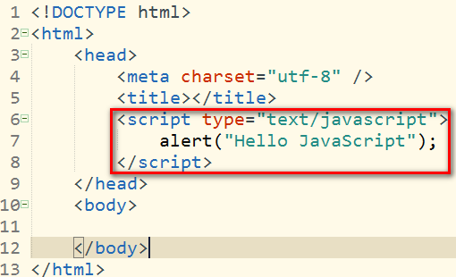
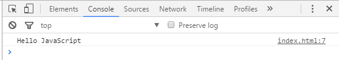
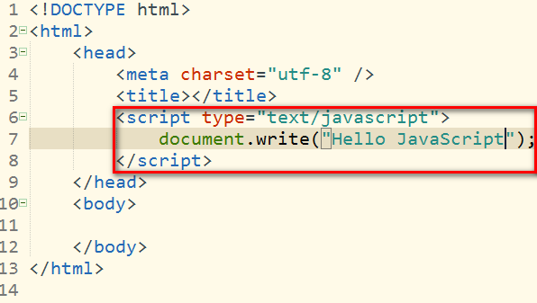
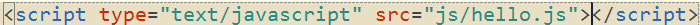

## 一、起源
- 1995年由网景公司发明
- 早期网速比较慢，网页上的用户信息验证是由服务器负责的，速度特别慢，用户体验差，网景公司发现了该问题并发明了JavaScript，现在网速较快，所以网页信息验证并不是JavaScript的唯一功能
- EcmaScript是JavaScript的标准，但不提供具体的实现
- 不同的浏览器对EmacScript由不同的实现，如火狐的spidermonkey引擎，谷歌浏览器的V8引擎
- 完整的JavaScript实现应该包含以下三个部分
  - EcmaScript标准
  - DOM
  - BOM

## 二、第一个简单的JavaScript程序
- 我们先将JavaScript程序写在网页当中
	- head标签的scripts子标签中
- 使用alter
  - 弹出警告窗口
 
实例：



显示效果：


- 使用console.log
  - 在控制台上显示内容（一般按F12键可以打开浏览器的开发者工具栏，就可以找到控制台）

实例代码：


显示效果：



- 使用document.wtite
  - 在body标签中写入内容

实例代码：



显示效果：


## 三、编写JavaScript的位置

- 可以直接编写在指定的标签当中

如：

在botton的onclick属性中编写js代码

```
<button onclick="alert('Hello JavaScript');">点击按钮</button>
```

上面的代码的作用是点击按钮的时候出现警告窗口

还可以在a的href的属性中编写js代码


```
<a href="javascript:alert('Hello')">点击我试试</a>
```

上面的代码的作用是当点击链接的时候会出现警告窗口

**注意:编写的js代码中不要出现双引号，不然会出现语法错误，这是因为属性值本身就是用双引号包围的，若在属性值中出先双引号，浏览器解析属性值的时候就会出错**

- 可以在script标签中编写js代码

例如我们上面介绍第一个js程序的时候使用的就是这种方式

- 在页面中引用外部的js程序
  - 将js代码编写在一个js文件中
  - 通过script标签中的src属性引用外部的js文件

如：

